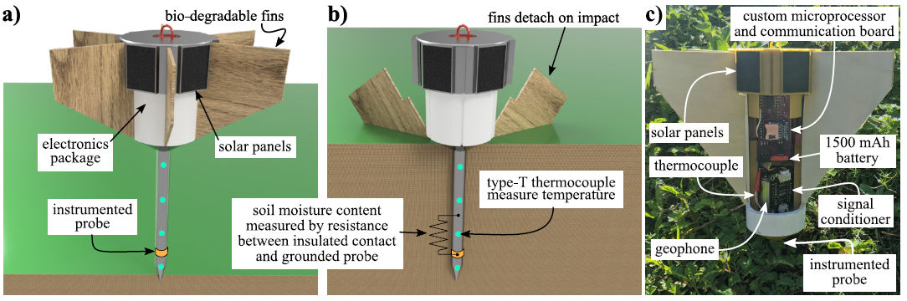

# Smart Penetrometer with Edge Computing and Intelligent Embedded Systems (SPECIES) 
### Design and develop UAV-deployable smart sensor nodes in a network with edge computing and solar-charging capabilities for soil classification and fault detection.

## Licensing and Citation

[![CC BY-SA 4.0][cc-by-sa-shield]][cc-by-sa]

This work is licensed under a
[Creative Commons Attribution-ShareAlike 4.0 International License][cc-by-sa].

[cc-by-sa]: http://creativecommons.org/licenses/by-sa/4.0/
[cc-by-sa-image]: https://licensebuttons.net/l/by-sa/4.0/88x31.png
[cc-by-sa-shield]: https://img.shields.io/badge/License-CC%20BY--SA%204.0-lightgrey.svg

Cite as:

@Misc{ARTSLabSmartPenetrometerEdge,  
  author       = {ARTS-Lab},  
  howpublished = {GitHub},  
  title        = {Smart Penetrometer with Edge Computing and Intelligent Embedded Systems},  
  groups       = {ARTS-Lab},  
  url          = {https://github.com/ARTS-Laboratory/Smart-Penetrometers-with-Edge-Computing-and-Intelligent-Embedded-Systems},  
}

