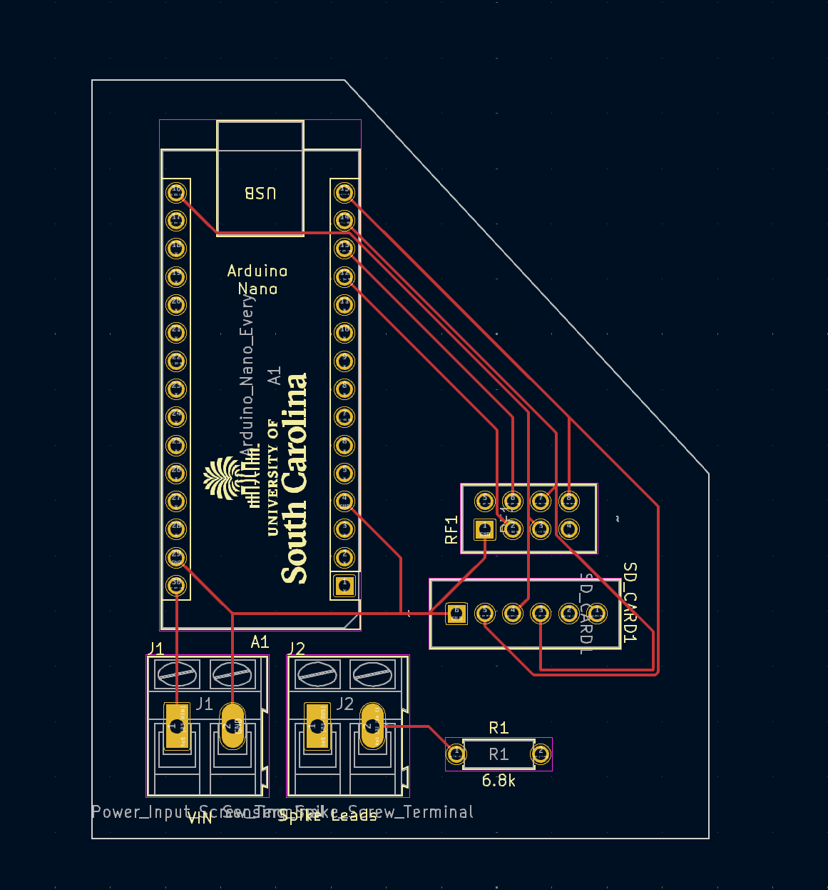

# v0.1
Files related to "spike-only" sensor package version.

## Arduino
`/Arduino/rf24_network.ino` is the code for a sensor spike node. The node's address is declared, data is collected and transmitted to the base station.

A unique address must be assigned to each node in the `this_node` variable in file `Arduino/rf24_network.ino`

`0o00` will be the address of the base station. Each node can be labeled `0o01, 0o02, etc...`

## RaspberryPi
`/RaspberryPi/rf24_network.py` is the code for the base station. The base station's address is established and data is recieved from the children nodes. 

All known nodes must be declared in the `OTHER_NODES` list.
Ex: for 5 nodes connected to base station `OTHER_NODES = [0o1, 0o2, 0o3, 0o4, 0o5]`

*Max of 5 nodes able to connect to nRF24L01+ chip at once.

## Spike PCB
PCB for a sensor spike node.

