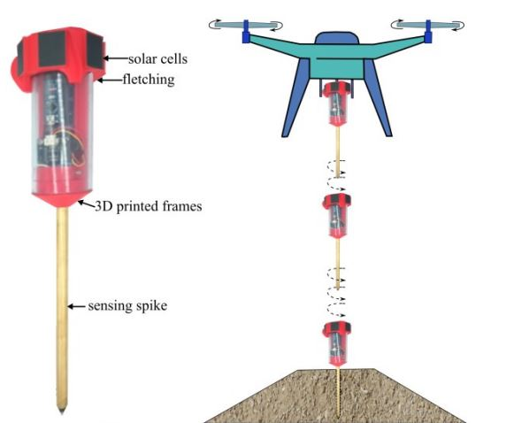

# Smart Penetrometer with Edge Computing and Intelligent Embedded Systems (SPECIES) - Systems Development
The SPECIES sensor package can be constructed in several versions, each named after a river with significant levee systems.

## Version - Columbia
* A full-scale development system that uses full-size amplifiers, filters, and switches. 

## Version - Mississippi
* A wireless version of the Columbia system with only the soil mositure sensing spiek.

## Version - Missouri
* A geophone sensor with GPS that saves data directly to an SD card. 

